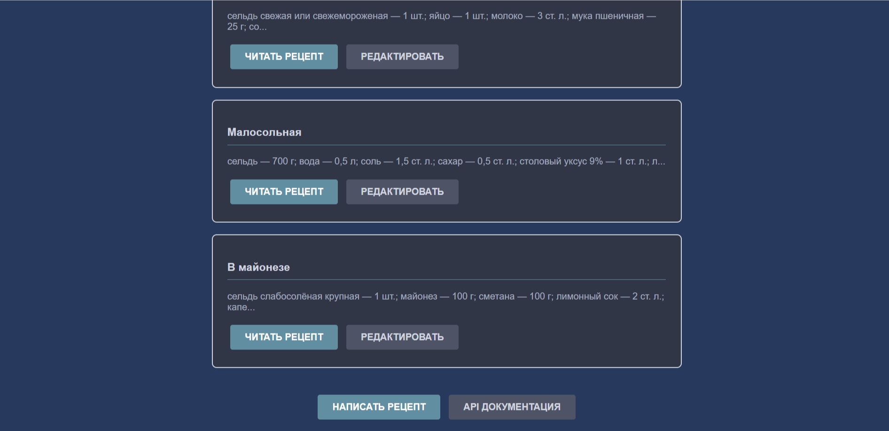
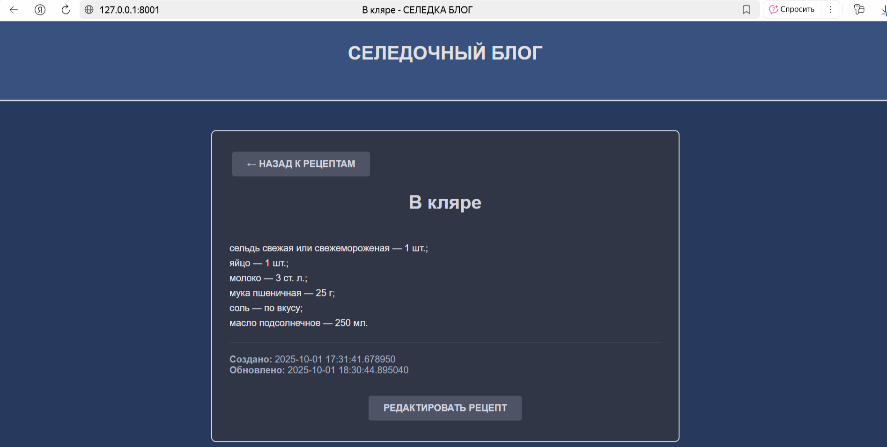
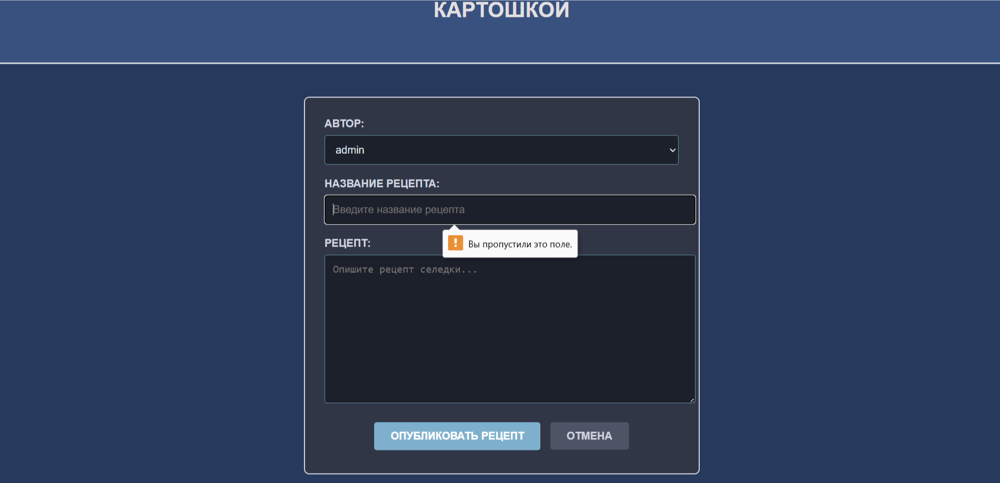
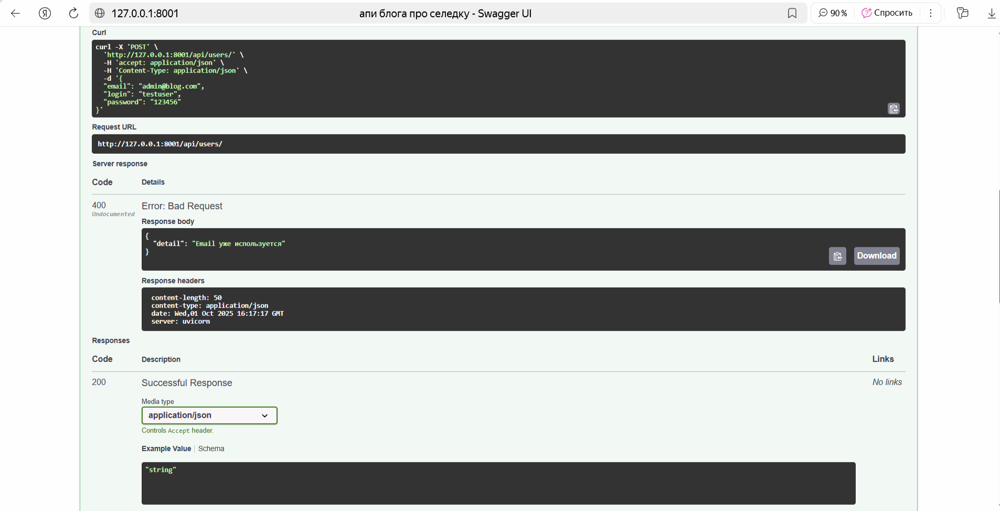

## Результаты работы

### Обычная страница блога


### Чтение поста


### Редактирование поста


### API


### Ошибка валидации


### Ошибка валидации (заходим на несуществующий пост)


### Ошибка валидации (проверка email)




## Финальный проект

### 📱 Фронтенд
- **Регистрация и авторизация** пользователей
- **Создание и редактирование** постов
- **Лента постов** с пагинацией
- **Поиск** по постам и пользователям
- **Лайки** и **избранное** для постов
- **Валидация форм** и обработка ошибок
- **Адаптивный интерфейс**

### 🔧 Бэкенд
- **REST API** на FastAPI
- **PostgreSQL** база данных
- **JWT авторизация**
- **Ролевая система** (админ/пользователь)
- **Пагинация** и фильтрация
- **Docker** контейнеризация
- **Alembic** миграции

##  Выполненные требования ТЗ

###  Фронтенд (15/13+ баллов - оценка 5)
| Требование | Статус | Баллы |
|------------|--------|-------|
| Регистрация и аутентификация | ✅ Выполнено | 2 |
| Страница профиля | ✅ Выполнено | 1 |
| Главная страница с лентой | ✅ Выполнено | 1 |
| Создание поста | ✅ Выполнено | 1 |
| Поиск постов | ✅ Выполнено | 1 |
| Поиск пользователей | ✅ Выполнено | 1 |
| Лайки к постам | ✅ Выполнено | 1 |
| Избранные посты | ✅ Выполнено | 1 |
| Валидация данных форм | ✅ Выполнено | 1 |
| Обработка серверных ошибок | ✅ Выполнено | 1 |
| Unit тесты + 50% coverage | ✅ 91% coverage | 2 |
| E2E тесты | ✅ Выполнено | 2 |

### Бэкенд (13/11+ баллов - оценка 5)
| Требование | Статус | Баллы |
|------------|--------|-------|
| Хранение в БД (PostgreSQL) | ✅ Выполнено | 1 |
| Миграции (Alembic) | ✅ Выполнено | 1 |
| Контейнеризация (Docker) | ✅ Выполнено | 1 |
| CRUD операции | ✅ Выполнено | 2 |
| Валидация и обработка ошибок | ✅ Выполнено | 1 |
| Авторизация (JWT) | ✅ Выполнено | 1 |
| Пагинация и фильтрация | ✅ Выполнено | 1 |
| Ролевая система | ✅ Выполнено | 1 |
| Unit + интеграционные тесты | ✅ Выполнено | 2 |
| Coverage > 50% | ✅ 91% coverage | 2 |

##  Тестирование

- **Unit тестов**: 13
- **Coverage**: 91%
- **Все тесты проходят**: ✅

```bash
# Запуск тестов
coverage run -m pytest tests/
coverage report

# Результат: 91% coverage, 13 тестов пройдено